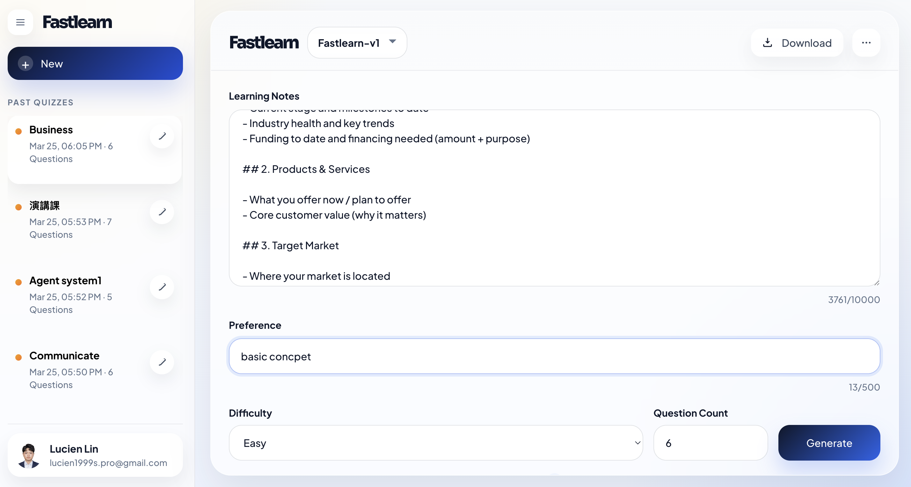
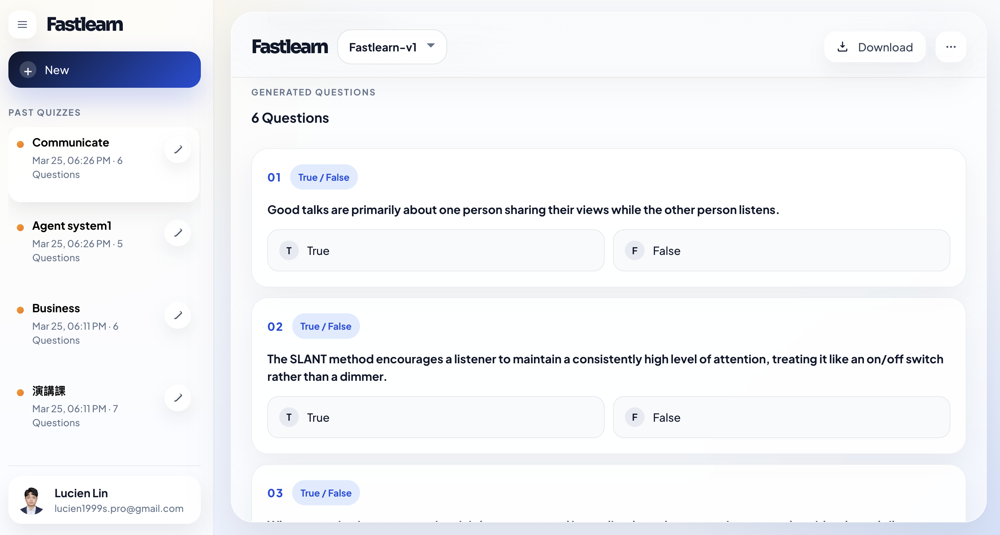
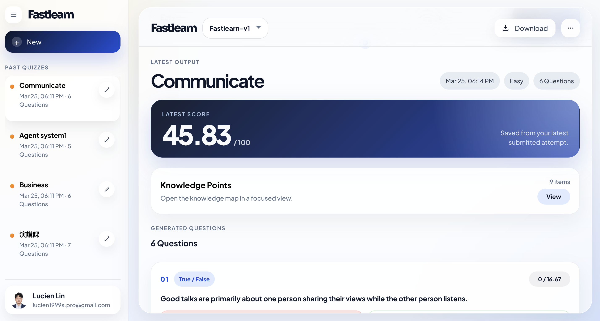
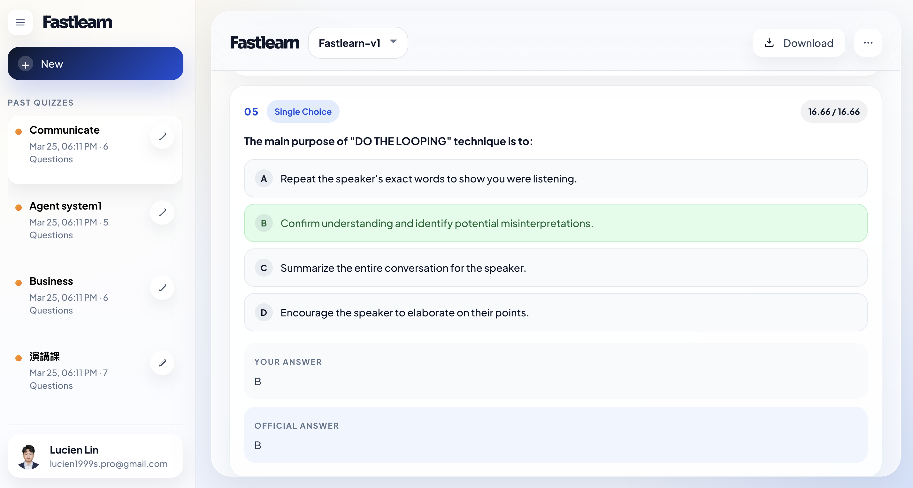
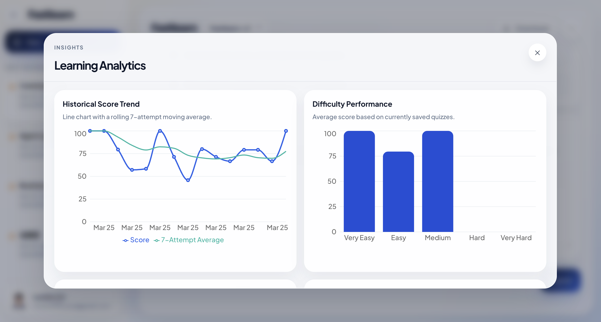
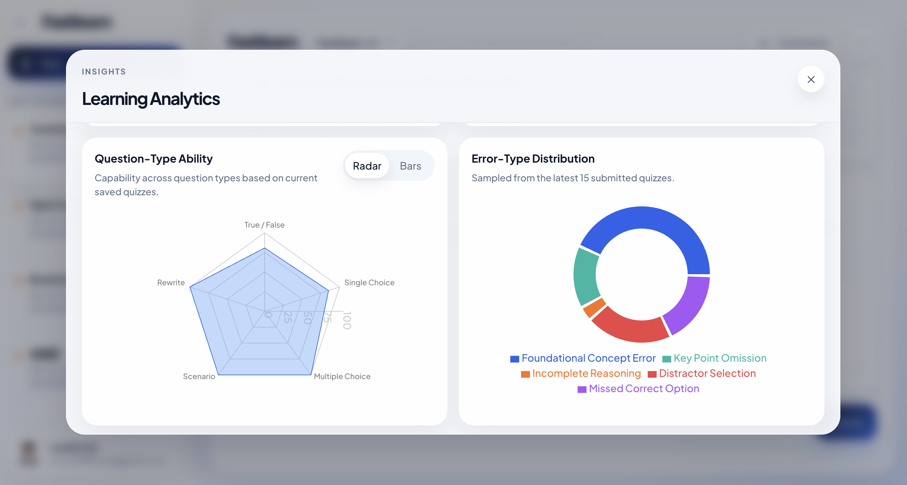
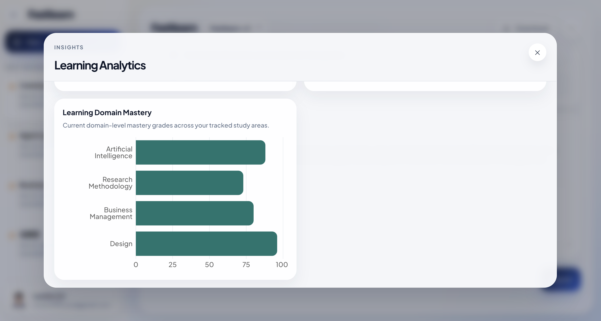
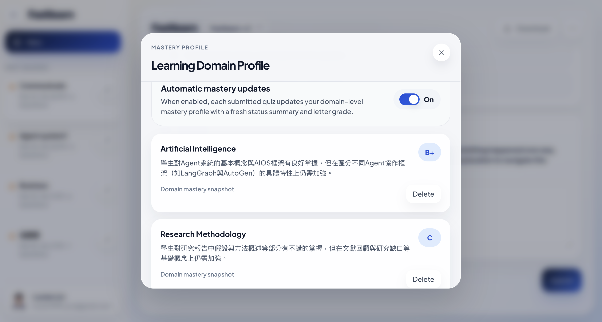

# Fastlearn

Fastlearn is an AI-powered study workspace that converts raw learning notes into structured quizzes, grades completed attempts with rule-based and LLM-assisted evaluation, tracks long-term performance, and builds a domain-level learning profile over time. It combines a FastAPI backend, a React + TypeScript frontend, PostgreSQL persistence, Google Sign-In, analytics dashboards, and downloadable quiz/report exports into a single full-stack application for iterative self-testing.

## Run The Full Project

### 1. Create your environment file

Copy the example file and fill in the required values:

```bash
cp .env.example .env
```

Required:

- `GOOGLE_API_KEY`
- `GOOGLE_CLIENT_ID`

Recommended:

- `SUPERUSER_EMAIL`

### 2. Start the stack with Docker

From the repo root:

```bash
docker compose up --build
```

### 3. Open the app

- Frontend: `http://127.0.0.1:3000`
- Backend Swagger: `http://127.0.0.1:8000/docs`
- Backend ReDoc: `http://127.0.0.1:8000/redoc`

## Environment Variables

| Variable | Required | Purpose |
| --- | --- | --- |
| `GOOGLE_API_KEY` | Yes | Used by the backend LLM workflows for quiz generation, scoring support, and learning-profile updates. |
| `GOOGLE_CLIENT_ID` | Yes | Used by Google Sign-In on the frontend and by the backend to verify Google identity tokens. |
| `SUPERUSER_EMAIL` | Recommended | Grants permanent admin access to the specified Google account. |
| `SESSION_COOKIE_NAME` | No | Name of the browser session cookie. Default: `fastlearn_session`. |
| `SESSION_MAX_AGE_SECONDS` | No | Session lifetime in seconds. Default: `2592000` (30 days). |
| `SESSION_COOKIE_SECURE` | No | Set `true` for HTTPS deployments. Use `false` for local HTTP development. |
| `SESSION_COOKIE_SAMESITE` | No | Cookie same-site policy. Local default is `lax`. |
| `CORS_ALLOW_ORIGINS` | No | Allowed frontend origins for the backend API. Local defaults are already provided. |
| `DATABASE_URL` | Optional | Only needed for local backend development outside Docker Compose. Docker Compose already injects it for the backend container. |

## Demo

### 1. Generate a quiz from your study notes

Paste your learning notes, optionally add a preference, choose a difficulty level, set the question count, and click **Generate**. Fastlearn is designed for quick self-testing from dense notes, lecture summaries, interview prep material, or topic-specific study outlines.



### 2. Take the test in the app

Fastlearn supports multiple question formats, including true/false, single-choice, multiple-choice, scenario questions, and rewrite-style prompts. You can answer directly inside the workspace and submit the full attempt when finished.



### 3. Review AI-assisted scoring and answer feedback

After submission, Fastlearn calculates a weighted score across the full quiz and presents answer-level review states. Objective questions are scored deterministically, while open-ended responses are judged against rubric-style expectations with AI assistance.



The review view then breaks the attempt down question by question, showing your answer, the official answer, and correctness feedback in context.



### 4. Inspect learning analytics

The **Insights** panel summarizes historical performance and helps users see how their learning behavior changes over time.

The score trend view highlights total-score progression and adds a rolling moving average for a clearer long-term signal.



The analytics dashboard also compares question-type ability and error-type distribution, making it easier to spot whether mistakes come from concept gaps, reasoning gaps, distractor choices, or missed correct options.



Fastlearn also tracks domain-level mastery so users can understand how they are progressing across different study areas rather than only reviewing raw quiz scores.



### 5. Turn on domain-level learning profile updates

Inside **Personalize**, users can enable automatic domain-profile updates. When enabled, each submitted quiz can contribute to an AI-generated mastery snapshot for the relevant study domain, helping build a running picture of strengths, gaps, and current study status.


